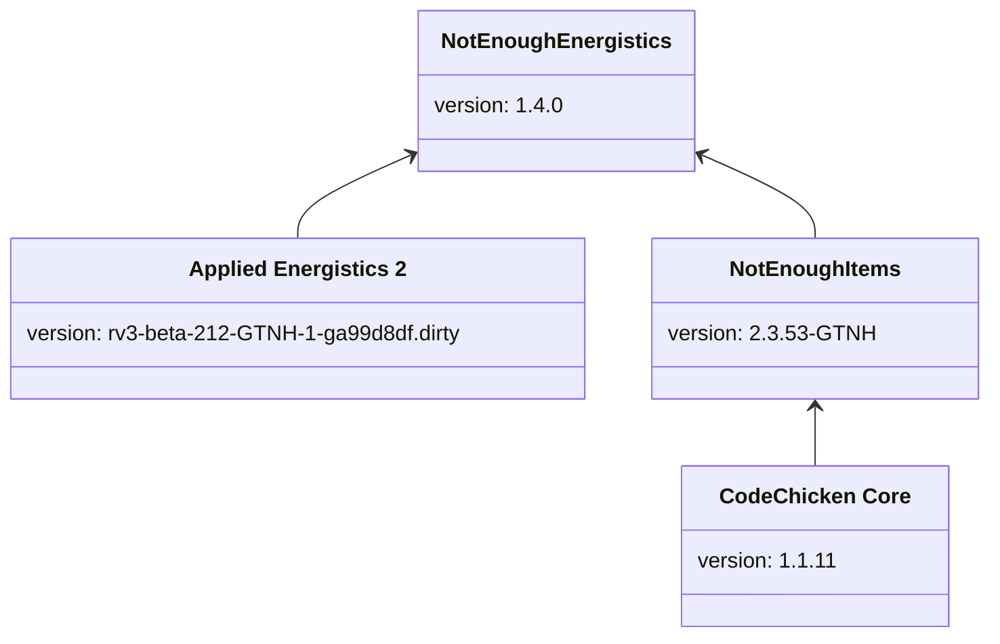

# Age-of-Tech
Arquivos de configuração do Age of Tech

# Mods

```mermaid
classDiagram
    class CodeChickenCore["CodeChicken Core"] {
        version: 1.1.11
    }


    class appliedenergistics2["Applied Energistics 2"] {
        version: rv3-beta-212-GTNH-1-ga99d8df.dirty
    }

    class NotEnoughItems["NotEnoughItems"] {
        version: 2.3.53-GTNH
    }
    NotEnoughItems <-- CodeChickenCore

    class neenergistics["NotEnoughEnergistics"] {
        version: 1.4.0
    }
    neenergistics <-- NotEnoughItems
    neenergistics <-- appliedenergistics2


```
